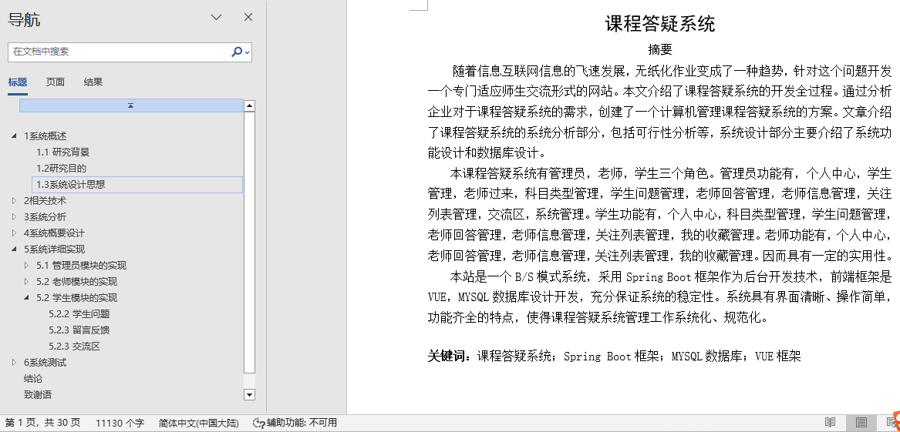

## 基于vue的课程答疑系统(程序+报告)

###  获取sql数据库文件: 从戎源码网 (https://armycodes.com/) QQ: 386869957 QQ群: 377586148
###  所有系统地址: (https://github.com/YuLin-Coder/AllProjectCatalog) 
###  所有项目以及源代码本人均调试运行无问题 可支持远程安装部署调试、定制修改、代码讲解

## 项目介绍
基于vue的课程答疑系统，系统包含两种角色：用户、管理员，系统分为前台和后台两大模块，主要功能如下：

1管理员模块的实现
- 学生信息管理: 管理学生信息，包括添加、修改、删除和查询学生数据。
- 科目类型管理: 管理科目类型，包括添加、修改、删除和查询操作。

2老师模块的实现
- 老师回答管理: 查看和查询老师的回答。
- 我的收藏管理: 管理收藏的内容，包括添加、修改、删除和查询操作。

3学生模块的实现
- 学生问题: 查看和发布学生问题信息。
- 留言反馈: 查看老师的回答信息。
- 交流区: 在交流区发布信息。

## 项目技术
- 编程语言：Java
- 数据库：MySQL
- 项目管理工具：Maven
- 前端技术：HTML、CSS、JavaScript、Vue
- 后端技术：Spring、SpringMVC、MyBatis

## 运行环境
- JDK版本：JDK1.8及以上
- 开发工具：IDEA、Ecplise、Myecplise都可以
- 数据库: MySQL5.7及以上
- Maven：maven3.0及以上
- Node：14.14.0及以上

## 运行截图

